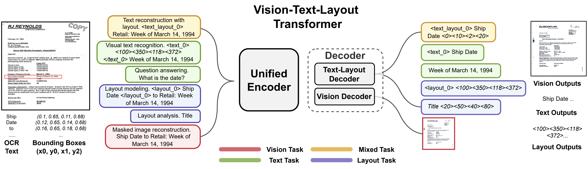

# [Unifying Vision, Text, and Layout for Universal Document Processing](https://arxiv.org/pdf/2212.02623)
[Zineng Tang](https://zinengtang.github.io/),
[Ziyi Yang](https://ziyi-yang.github.io/),
[Guoxin Wang](https://www.guoxwang.com/),
[Yuwei Fang](https://www.microsoft.com/en-us/research/people/yuwfan/),
[Yang Liu](https://nlp-yang.github.io/),
[Chenguang Zhu](https://cs.stanford.edu/people/cgzhu/),
[Michael Zeng](https://www.microsoft.com/en-us/research/people/nzeng/),
[Cha Zhang](https://www.microsoft.com/en-us/research/people/chazhang/),
[Mohit Bansal](https://www.cs.unc.edu/~mbansal/)
              

Open Source Checklist:

- [x] Release Model (Encoder + Text decoder)
- [x] Release Most Scripts
- [ ] Vision Decoder / Weights (Due to fake document generation ethical consideration, we plan to release this functionality as an Azure API)
- [ ] Demos

## Introduction 

UDOP unifies vision, text, and layout through vision-text-layout Transformer and unified generative pretraining tasks including
vision task, text task, layout task, and mixed task. We show the task prompts (left) and task targets (right) for all self-supervised objectives
(joint text-layout reconstruction, visual text recognition, layout modeling, and masked autoencoding) and two example supervised objectives
(question answering and layout analysis).

<p align="center">
  
</p>

## Install
### Setup `python` environment
```
conda create -n UDOP python=3.8   # You can also use other environment.
```
### Install other dependencies
```
pip install -r requirements.txt
```

## Run Scripts

Switch model type by:

--model_type "UdopDual"

--model_type "UdopUnimodel"

### Finetuninng on RVLCDIP

Download RVLCDIP first and change the path
For OCR, you might need to customize your code
```
bash scripts/finetune_rvlcdip.sh   # Finetuning on RVLCDIP
```

### Finetuninng on DUE Benchmark

Download [Duebenchmark](https://github.com/due-benchmark/baselines) and follow its procedure to preprocess the data.

The training code adapted to our framework is hosted at benchmarker by running:

```
bash scripts/finetune_duebenchmark.sh   # Finetuning on DUE Benchmark, Switch tasks by changing path to the dataset
```

Evaluation of the output generation can be evaluated by [Duebenchmark due_evaluator](https://github.com/due-benchmark/evaluator)

### Model Checkpoints
The model checkpoints are hosted here [Huggingface Hub](https://huggingface.co/ZinengTang/Udop)

- UdopUnimodel-Large-224 [Download](https://huggingface.co/ZinengTang/Udop/resolve/main/udop-unimodel-large-224.zip)

- UdopDual-Large-224 [Download](https://huggingface.co/ZinengTang/Udop/resolve/main/udop-dual-large-224.zip)

## Citation
```
@article{tang2022unifying,
  title={Unifying Vision, Text, and Layout for Universal Document Processing},
  author={Tang, Zineng and Yang, Ziyi and Wang, Guoxin and Fang, Yuwei and Liu, Yang and Zhu, Chenguang and Zeng, Michael and Zhang, Cha and Bansal, Mohit},
  journal={arXiv preprint arXiv:2212.02623},
  year={2022}
}
```

## Contact

Zineng Tang (zn.tang.terran@gmail.com)
