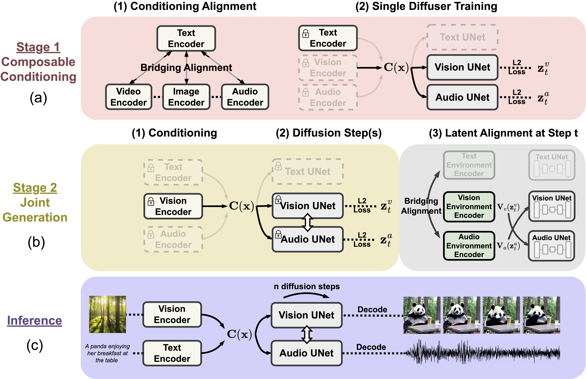

# [CoDi: Any-to-Any Generation via Composable Diffusion]()
[Zineng Tang]("https://zinengtang.github.io/")
[Ziyi Yang]("https://ziyi-yang.github.io/")
[Chenguang Zhu]("https://www.microsoft.com/en-us/research/people/chezhu/")
[Michael Zeng]("https://www.microsoft.com/en-us/research/people/nzeng/")
[Mohit Bansal]("https://www.cs.unc.edu/~mbansal/")
              

Open Source Checklist:

- [x] Release Code Structure
- [ ] Release Scripts and Checkpoints

## Introduction 

We present Composable Diffusion (CoDi), a novel generative model capable of generating any combination of output modalities, such as language, image, video, or audio, from any combination of input modalities. Unlike existing generative AI systems, CoDi can generate multiple modalities in parallel and its input is not limited to a subset of modalities like text or image. Despite the absence of training datasets for many combinations of modalities, we propose to align modalities in both the input and output space. This allows CoDi to freely condition on any input combination and generate any group of modalities, even if they are not present in the training data. CoDi employs a novel composable generation strategy which involves building a shared multimodal space by bridging alignment in the diffusion process, enabling the synchronized generation of intertwined modalities, such as temporally aligned video and audio. Highly customizable and flexible, CoDi achieves strong joint-modality generation quality, and outperforms or is on par with the unimodal state-of-the-art for single-modality synthesis.  

  Overview Demo
  

  Model Architecture
  

## Contact

Zineng Tang (zn.tang.terran@gmail.com)
